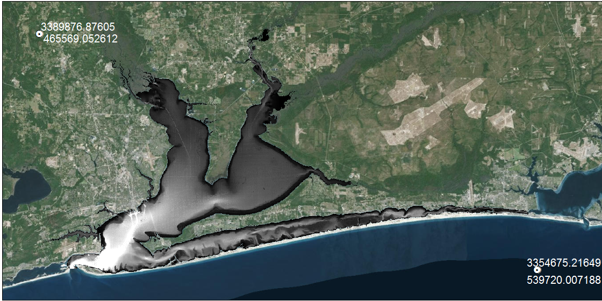

```{r message = F, echo = F, warning = F}
knitr::opts_chunk$set(echo = F, warning = F, message = F)

library(plotly)
library(tidyverse)
library(raster)
library(fields)
library(gridExtra)
library(maptools)
source('R/funcs.R')
```


## Create model grid

Importing a base map: https://www.youtube.com/watch?v=URDI1LP_McI

Using the software: https://www.youtube.com/watch?v=YUrRRYfGq5I\

Example grids: http://www.efdc-explorer.com/products/interfaces.html

Workflow 

1. *Create base map* A geo-referenced background map must be imported as a .georef file in CVL Grid.  This file is created by importing an unreferenced .bmp file which can be created in ArcMap.  The user identifies two reference points in UTM coordinates on the .bmp file.  These two reference points can be anywhere on the image.  The reference points are then used to identify the upper left and lower right corners of the image.  The .georef file can be saved once all four coordinates are identified. The image below shows the imported .bmp file.  Lat/Lon locations of two points were displayed for manual entry in CVL Grid. 

2. *Create a small grid* The complete grid is created by sequential combination of smaller grids. The smaller grids are created by outlining a general area with spline curves, then filling the area with an i x j grid.  Four separate splines are required for each grid and their intersection points must be approximately perpendicular.  The spline and create grid functions are on the top toolbar.  Only one spline layer can be used at a time, so it should be deleted after creating each grid. Individual grids can be edited using a combination of manual repositioning with grid buttons on the top toolbar or automated tools for smoothing, orthogonality, redistribution, refining (more cells), or coarsening (less cells).  The latter functions are accessed with a right-mouse click.  

3.	*Combine one grid to another* After creating the first grid, another small grid can be created and combined with the first.  This is repeated until the entire grid is created.  Two grids are combined by right-clicking the map, selecting the connect grid option, and identifying points to join.  CVL Grid combines all nearest nodes automatically and works best if the cell dimensions between grids are equal.  

4.	*Check and edit orthogonality* Grid orthogonality can be viewed by selecting the appropriate option in the top-right menu.  Orthogonality can be improved through manual editing or with the orthogonality tool (local or global) available with right-click.  

5.	*Export grid* The grid can be exported as a shapefile from the file menu on the top and as EFDC .inp files using the separate button on the top toolbar.  The relevant grid input files are:

    * `cell.inp` Horizontal cell type identifier file.
    
    * `celllt.inp` Horizontal cell type identifier file for saving mean mass transport.
    
    * `dxdy.inp` File specifying horizontal grid spacing or metrics, depth, bottom elevation, bottom roughness and vegetation classes for either Cartesian or curvilinear-orthogonal horizontal grids. Depth values were added manually with an R script using a bathymetry layers.  Zero depth values will cause an error and should be floored at a minimum not equal to zero.
    
    * `lxly.inp` File specifying horizontal cell center coordinates and cell orientations for
    either Cartesian or curvilinear-orthogonal grids.
    
    * `mappgns.inp` Specifies configuration of the model grid to represent a periodic region in the north-south or computational y direction.
    
    * `mask.inp` File specifying thin barriers to block flow across specified cell faces.

6. Add depth to to `dxdy.inp`.  This is done in R by combining the cvl grid shapefile and manually created bathymetry raster. The empty depth column in `dxdy.inp` is replaced with the average depth in each grid cell (L).

```{r, fig.height = 6, fig.width = 10}
data(pb_grid)

deps <- dplyr::select(pb_grid@data, L, depth) %>% 
  rename(id = L) %>% 
  mutate(id = as.character(id))
toplo <- fortify(pb_grid, region = 'L') %>% 
  left_join(deps, by = 'id')

p <- ggplot(toplo) + 
  aes(long, lat, group = group, fill = depth) + 
  geom_polygon() +
  geom_path(color="darkgrey") +
  coord_equal() + 
  scale_fill_distiller(palette = 'Spectral') +
  theme_minimal() +
  theme(legend.position = 'top', axis.title.x = element_blank(), axis.title.y = element_blank()) 
p

```

```{r, fig.height = 8, fig.width = 6}

# import dxdy file with no depth data
dxdy <- readLines('EFDC/dxdy.inp')

# format for merge
dxdy <- dxdy[-c(1:4)] %>% 
  strsplit(., '\\s+') %>% 
  do.call('rbind', .) %>% 
  data.frame(stringsAsFactors = F) %>% 
  rename(
    I = X2, 
    J = X3, 
    depth = X6
  ) %>% 
  mutate(
    I = as.numeric(I), 
    J = as.numeric(J), 
    depth = as.numeric(depth)
  )
    
ggplot(dxdy, aes(x = I, y = J, colour = depth)) + 
  geom_point() + 
  scale_colour_distiller(palette = 'Spectral') + 
  theme_minimal()
```

## Time series forcing and boundary condition files

Input data for nine years were previously assembled by TetraTech. These included meteorological data for atmospheric pressure, temperature, rainfall, wind speed and direction, and cloud cover.  Thirteen inland boundary conditions included time series of freshwater inflows at eight sites and five point sources, where flow and water temperature were available at each location. Data from Offshore bounday conditions were water surface elevation (WSE)), temperature, and salinity.  Water surface elevation and temperature were obtained from the NOAA tidal station 8729840 near the port of Pensacola.  Offshore boundary salinity values were estimated at 35 psu for each cell.  The following files were copied directly from an existing model but will need to be updated if new or different boundary conditions are used.  

* `ASER.INP` Atmospheric forcing conditions including pressure, temperature, rainfall, evaporation by decimal julian day

* `DSER.INP` Dye concentration time series file.

* `PSER.INP` Open boundary water surface elevation time series file, NOAA tidal station 8729840 (near port).

* `QSER.INP` Inflows by julian day, includes rivers/streams and  point sources

* `SSER.INP` Offshore salinity boundary conditions

* `TSER.INP` Temperature for each inflow, by julian day, including temperature from offshore boundary conditions

* `WSER.INP` Hourly measurements of wind speed and direction

Other input data are not empirical observations, e.g., dye simulations, or are required to 'cold-start' the model.  These must be updated for the grid (based on i, j) and sigma layers.  An R function was created for each that requires `dxdy.inp` as input.   

* `DYE.INP` File with initial dye distribution for cold start simulations.

* `SALT.INP` File with initial salinity distribution for cold start, salinity stratified flow simulations.

* `TEMP.INP` File with initial temperature distribution for cold start simulations.

Miscellaneous files were copied from an existing EFDC model. 

* `efcd_add.inp` Additional information for `efdc.inp`

* `gwater.inp` File specifying the characteristic of a simple soil moisture model.

* `modchan.inp` Subgrid scale channel model specification file.

* `moddxdy.inp` File specifying modification to cell sizes (used primarily for calibration adjustment of subgrid scale channel widths)

* `show.inp` File controlling screen print of conditions in a specified cell during simulation runs.

## Update `EFDC.INP`

This is the master EFDC input file.  It contains several 'cards', not all of which must be updated for a new model. The following notes those that must be changed or verified using a new grid and/or input data.

* Card 7: Simulation time steps. NTC is the number of reference time steps in the entire simulation, where the reference time step TREF is on card 8. For example, if NTC = 60, and TREF is 86400, the reference time is one day (in seconds), so the total simulation is sixty days.  NTSPTC describes the number of time steps per reference time period.  For example, if TREF is 86400 and NTSPTC is 8640, the time step is ten seconds (8640 * 10 = 86400).

* Card 8: Additional time parameters including reference time period (TREF) and start time for output files (TBEGIN).

* Card 9: Smoothing parameters, describes information about the grid.  This can be copied from the EFDC file created with CVL grid.

* Card 11: Grid roughness and depth. This card appears to be turned off with ISCO (card 9).

* Card 17: Surface elevation boundary conditions. Set the appropriate number of open boundaries by direction (i.e., open cells in the gulf or the east/west where tidal flow can occur in/out). Set NPSER to 1 to have the model read in one tidal time series dataset from PSER. 

*	Card 19-22: Tidal boundaries (S, W, E, N), Enter I, J indices of appropriate tidal boundaries. Make sure the count for each boundary matches Card 17.

* Card 23: Indicate the number of relevant input datasets as concentration time series. Check NSSER, NTSER, and NDSER based on the available input files. Values should equal the number of unique time series inputs to be entered in Card 24. Note that `NQSER` is the number of time series in `QSER.INP` and `NSIJ` is the number of grid cells associated with all.  

*	Card 24: Enter I,J indices of volume inputs (create QSER data input file in excel). Match the appropriate NQSERQ id (discharge) and NTSERQ id (temperature) to the I,J index. Match the Dye time series input locations to cells of interest (as needed, may need to update dye time series file. Number of time series should be 1 for each.

The I, J indices of each input were identified from a point shapefile of each location. 

```{r, fig.height = 6, fig.width = 10}
data(pb_grid)
data(qser_pts)

deps <- dplyr::select(pb_grid@data, L, depth) %>% 
  rename(id = L) %>% 
  mutate(id = as.character(id))
toplo <- fortify(pb_grid, region = 'L') %>% 
  left_join(deps, by = 'id')

pts <- qser_pts %>% 
  data.frame %>% 
  dplyr::select(coords.x1, coords.x2, descrip, Type)

p <- ggplot() +
  geom_path(data = toplo, color="darkgrey", aes(long, lat, group = group)) +
  ggrepel::geom_text_repel(
				data = pts, 
				aes(x = coords.x1, y = coords.x2, label = descrip),
				point.padding = grid::unit(0.4, "lines"), size = 3
				) +
  geom_point(data = pts, aes(x = coords.x1, y = coords.x2, colour= Type), size = 6, alpha = 0.8) +
  coord_equal() + 
  theme_minimal() + 
  theme(legend.position = 'top', axis.title.x = element_blank(), axis.title.y = element_blank()) 
p
```

* Card 27: Flow withdrawal and return info. This is reserved for power plant inputs and returns as two adjacent cells. Inputs as NQWR on Card 23 are entered here. 

* Card 28: Time constant withdrawal and return data.  Constant values for input/returns on Card 27.

* Card 30: Number of concentration boundary conditions (number of open cells to N, E, S, W)

* Cards 31 - 42: Updated each cardinal direction based on number of cells for Card 30. Must provide relevant salinity and temperature time series to supply to the boundary conditions. 

* Card 58: Controls for writing the output files.  NWTMSR is the number of time steps completed by the model for writing to the output files.  For example, if TREF (Card 8) is 86400 (one day) and NTSPTC is 8640 on Card 7, the model time step is 10 seconds.  If NWTMSR is 360, this means output is written every 360 * 10 = 3600 seconds, or every hour.  The output files have units in days, so there will be 24 values in each day.  

* Card 59: Locations for output of time series data for model calibration. Enter the grid locations of PB data. Maximum of nine locations.

```{r, fig.height = 6, fig.width = 10}
data(pb_grid)
data(field_pts)

deps <- dplyr::select(pb_grid@data, L, depth) %>% 
  rename(id = L) %>% 
  mutate(id = as.character(id))
toplo <- fortify(pb_grid, region = 'L') %>% 
  left_join(deps, by = 'id')

pts <- field_pts %>% 
  data.frame %>% 
  dplyr::select(coords.x1, coords.x2, descrip, name)

p <- ggplot() +
  geom_path(data = toplo, color="darkgrey", aes(long, lat, group = group)) +
  ggrepel::geom_text_repel(
				data = pts, 
				aes(x = coords.x1, y = coords.x2, label = name),
				point.padding = grid::unit(0.4, "lines"), size = 3
				) +
  geom_point(data = pts, aes(x = coords.x1, y = coords.x2, colour= descrip), size = 6, alpha = 0.8) +
  coord_equal() + 
  theme_minimal() + 
  theme(
    legend.position = 'top', 
    legend.title = element_blank(), 
    axis.title.x = element_blank(),
    axis.title.y = element_blank()
    ) 
p
```

## Evaluation of output files

Individual output files are created for each reference location indicated on card 59.

* `saltmsr[0-9].out` Salinity time series (psu)

* `seltmsr[0-9].out` Surface elevation time series, note that these data do not have all sigma layers, i.e., it only makes sense to use results from the top surface layer.  

* `u3dtmsr[0-9].out` East velocity time series (cm/s), internal mode

* `uvetmsr[0-9].out` East/north velocity time series (cm/s), external mode

* `v3dtmsr[0-9].out` North velocity time series (cm/s), internal mode

* `w3dtmsr[0-9].out` Vertical velocity time series (cm/s), internal mode

An example of the salinity output for sixty day model run, ten second time step (note the runup period):
```{r echo = F, warning = F, message = F, fig.width = 8, fig.height = 10}
root <- 'L:/lab/FloridaEstuaries/EFDC/PBay/runtest_orig'

source('R/funcs.R')
sal <- getout(root, 'sal')
toplo1 <- unnest(sal)

ggplot(toplo1, aes(x = datetime, y = val, group = k)) + 
  geom_line() + 
  theme_bw() + 
  facet_grid(location~k) + 
  scale_y_continuous('Salinity (psu)')
```

Water surface elevation:
```{r echo = F, warning = F, message = F, fig.width = 8, fig.height = 10}
sel <- getout(root, 'sel')
toplo2 <- unnest(sel) %>% 
  filter(k %in% 'k1')

ggplot(toplo2, aes(x = datetime, y = val)) + 
  geom_line() + 
  theme_bw() + 
  facet_grid(location~.) + 
  scale_y_continuous('Surface elevation')
```
