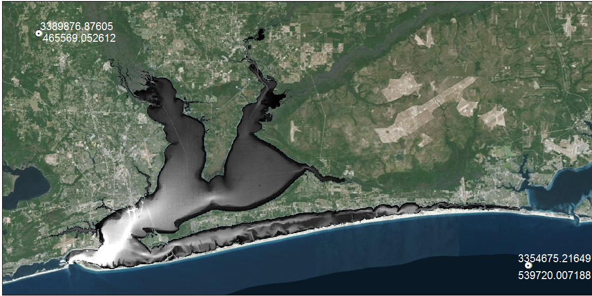
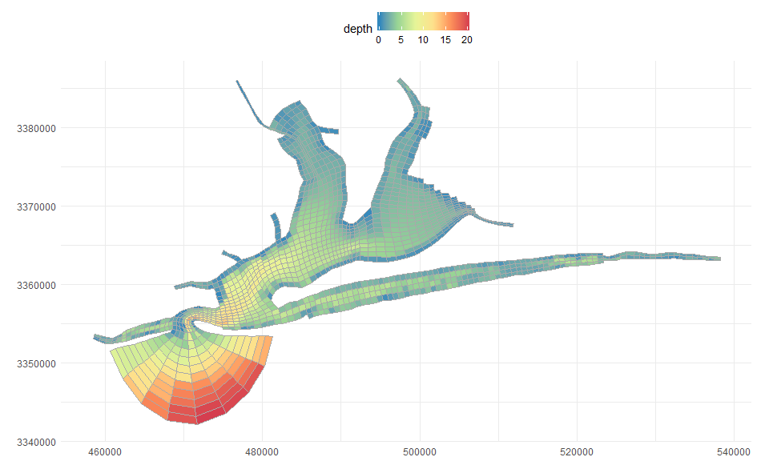
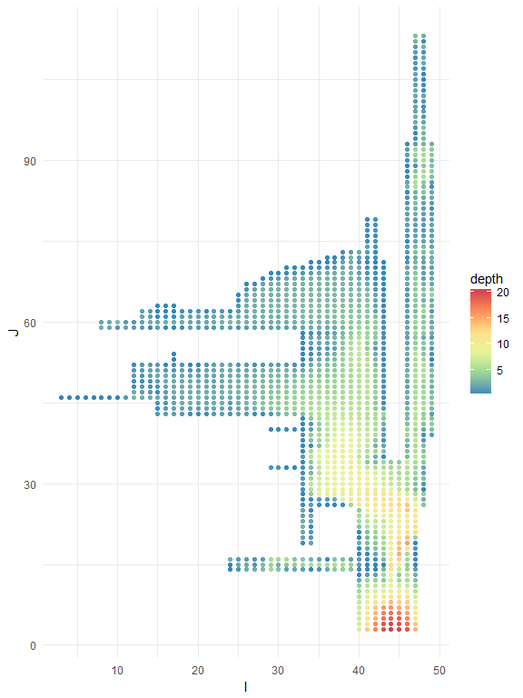

# README
Marcus W. Beck, beck.marcus@epa.gov  

## Create model grid

Importing a base map: https://www.youtube.com/watch?v=URDI1LP_McI

Using the software: https://www.youtube.com/watch?v=YUrRRYfGq5I\

Example grids: http://www.efdc-explorer.com/products/interfaces.html

Workflow 

1. *Create base map* A geo-referenced background map must be imported as a .georef file in CVL Grid.  This file is created by importing an unreferenced .bmp file which can be created in ArcMap.  The user identifies two reference points in UTM coordinates on the .bmp file.  These two reference points can be anywhere on the image.  The reference points are then used to identify the upper left and lower right corners of the image.  The .georef file can be saved once all four coordinates are identified. The image below shows the imported .bmp file.  Lat/Lon locations of two points were displayed for manual entry in CVL Grid. 

2. *Create a small grid* The complete grid is created by sequential combination of smaller grids. The smaller grids are created by outlining a general area with spline curves, then filling the area with an i x j grid.  Four separate splines are required for each grid and their intersection points must be approximately perpendicular.  The spline and create grid functions are on the top toolbar.  Only one spline layer can be used at a time, so it should be deleted after creating each grid. Individual grids can be edited using a combination of manual repositioning with grid buttons on the top toolbar or automated tools for smoothing, orthogonality, redistribution, refining (more cells), or coarsening (less cells).  The latter functions are accessed with a right-mouse click.  

3.	*Combine one grid to another* After creating the first grid, another small grid can be created and combined with the first.  This is repeated until the entire grid is created.  Two grids are combined by right-clicking the map, selecting the connect grid option, and identifying points to join.  CVL Grid combines all nearest nodes automatically and works best if the cell dimensions between grids are equal.  

4.	*Check and edit orthogonality* Grid orthogonality can be viewed by selecting the appropriate option in the top-right menu.  Orthogonality can be improved through manual editing or with the orthogonality tool (local or global) available with right-click.  

5.	*Export grid* The grid can be exported as a shapefile from the file menu on the top and as EFDC .inp files using the separate button on the top toolbar.  The relevant grid input files are:

    * `cell.inp` Horizontal cell type identifier file.
    
    * `celllt.inp` Horizontal cell type identifier file for saving mean mass transport.
    
    * `dxdy.inp` File specifying horizontal grid spacing or metrics, depth, bottom elevation, bottom roughness and vegetation classes for either Cartesian or curvilinear-orthogonal horizontal grids.
    
    * `lxly.inp` File specifying horizontal cell center coordinates and cell orientations for
    either Cartesian or curvilinear-orthogonal grids.
    
    * `mappgns.inp` Specifies configuration of the model grid to represent a periodic region in the north-south or computational y direction.
    
    * `mask.inp` File specifying thin barriers to block flow across specified cell faces.

6. Add depth to to `dxdy.inp`.  This is done in R by combining the cvl grid shapefile and manually created bathymetry raster. The empty depth column in `dxdy.inp` is replaced with the average depth in each grid cell (L).

<!-- -->

<!-- -->

## Time series forcing and boundary condition files

Input data for nine years were previously assembled by TetraTech. These included meteorological data for atmospheric pressure, temperature, rainfall, wind speed and direction, and cloud cover.  Thirteen inland boundary conditions included time series of freshwater inflows at eight sites and five point sources, where flow and water temperature were available at each location. Data from Offshore bounday conditions were water surface elevation (WSE)), temperature, and salinity.  Water surface elevation and temperature were obtained from the NOAA tidal station 8729840 near the port of Pensacola.  Offshore boundary salinity values were estimated at 35 psu for each cell.  The following files were copied directly from an existing model but will need to be updated if new or different boundary conditions are used.  

`ASER.INP` Atmospheric forcing conditions including pressure, temperature, rainfall, evaporation by decimal julian day

`DSER.INP` Dye concentration time series file.

`PSER.INP` Open boundary water surface elevation time series file, NOAA tidal station 8729840 (near port).

`QSER.INP` Inflows by julian day, includes rivers/streams and  point sources

`SSER.INP` Offshore salinity boundary conditions

`TSER.INP` Temperature for each inflow, by julian day, including temperature from offshore boundary conditions

`WSER.INP` Hourly measurements of wind speed and direction

Other input data are not empirical observations, e.g., dye simulations, or are required to 'cold-start' the model.  These must be updated for the grid (based on i, j) and sigma layers.  An R function was created for each that requires `dxdy.inp` as input.   

`DYE.INP` File with initial dye distribution for cold start simulations.

`SALT.INP` File with initial salinity distribution for cold start, salinity stratified flow simulations.

`TEMP.INP` File with initial temperature distribution for cold start simulations.

Miscellaneous files were copied from an existing EFDC model. 

`gwater.inp` File specifying the characteristic of a simple soil moisture model.

`modchan.inp` Subgrid scale channel model specification file.

`moddxdy.inp` File specifying modification to cell sizes (used primarily for calibration adjustment of subgrid scale channel widths)

`show.inp` File controlling screen print of conditions in a specified cell during simulation runs.

